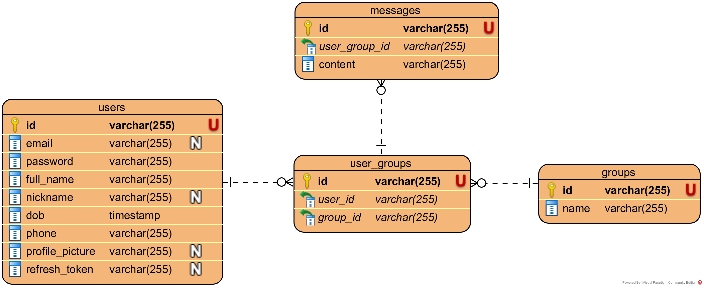

## About
Hello World

## Getting Started
1. Make sure you have already installed [Go](https://go.dev/dl/) and [PostgreSQL](https://www.postgresql.org/download/).
2. Clone the repository
    ```
    git clone https://github.com/Hydra-Gang/talkie-be.git
    ```

3. Install the dependencies
    ```
    go get
    ```

4. Duplicate the `.env.example` file to `.env` and fill the database credentials and the server port.

5. Run the development server
    ```
    go run .
    ```

### Entity-Relationship Diagram
